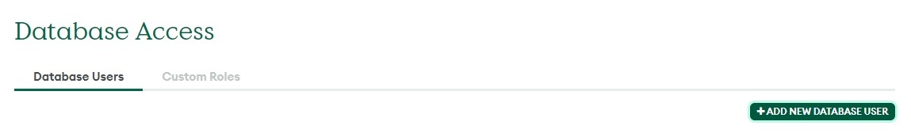
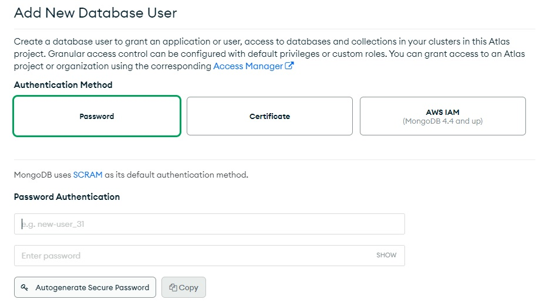
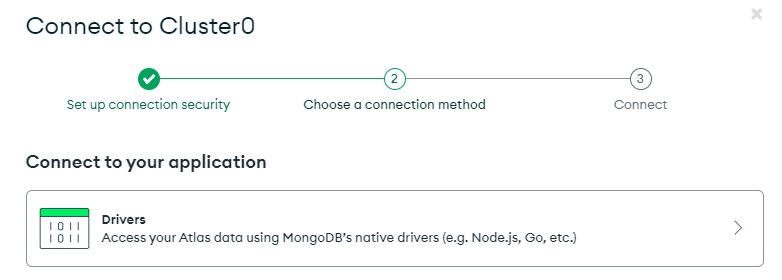
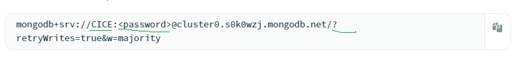

# node
# Guía para el usuario

## Paso 1.
### Instalación.
1. Descargar e instalar ***Node js*** en su ordenador [Link](https://nodejs.org/es).
2. Clonar el archivo [Link](https://github.com/ciceunicen/node).
3. Abrir la consola (cmd u otro) en la raiz del proyecto.
4. Ejecutar el comando ***npm i*** para instalar automáticamente todas las dependencias.
5. Levantar el proyecto con algún editor de código.
6. Crear un archivo ***.env*** para las varibles. Ver el archivo ***.env_example.*** para ejemplo.

## Paso 2.
### Como conectarse a MongoDB.
1. Crear cuenta en MongoCloud [Link](https://cloud.mongodb.com).
2. Ir a ***Database Access*** .
3. Crear ***Usuario y Password*** .
4. ***Conectarse*** .
5. Una vez realizo estos pasos se ***generará una URI*** .

### Paso 3
### Modificar URI de MongoBD.
1. Ya creado el archivo ***.env*** declarar variables y asignar el valor de la URI a una de ellas.
.
2. Reemplazar ***usuario y password*** por aquellos valores que ud. haya generado y sobre el final de la URI 
escribir el nombre que desee que tenga su coleccíon.

### Paso 4
1. Nuevamente, con la consola debe estar ***posicionado en la raíz*** del proyecto.
2. Ejecutar con mando ***npm start***
3. Su puerto correrá en el :5000

# Documentación de Node Js.
### Para mas información
1. Vea la ***documentación*** de node js [ver más](https://nodejs.org/es/docs).